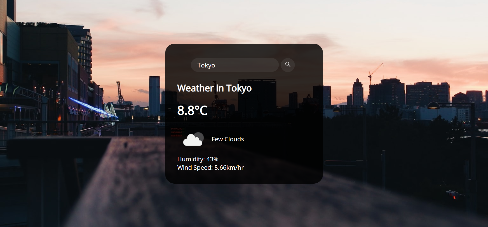

# Weather Insights
A weather app that allows you to search and display the weather conditions of any place in the world. It fetches the data from
openweathermap.org API and displays the result using HTML,CSS and Vanilla.js.

## Table of Contents
* [About](#About)
* [Technology](#Technology)
* [Deployment](#Deployment)
* [Snaps](#snaps)

### About 
This application fetches data from openweathermap.org and renders it on the client side using HTML& CSS. For the information to refresh dynamically we manipulated the JSON formatted data that we recieved from our api using Javascript.  

### Technology
1. ES6 javascript
2. HTML & CSS
3. GIT for version control system
### Deployment
The Webapp is deployed on netlify.
[Weather_Webapp](https://upbeat-ardinghelli-c80086.netlify.app/)
### Snaps

